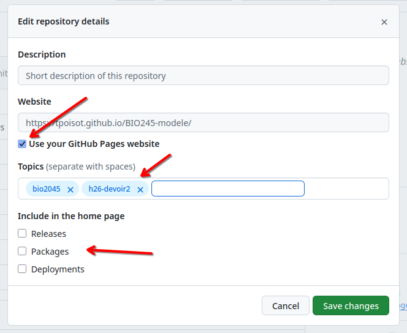

# Dépôt modèle pour le cours BIO 2045

<!-- Vous devrez supprimer les instructions, incluant ce commentaire -->

⚠️ **Important**: Le document compilé (`travail.pdf`) se trouve à `username.github.io/nom_du_repo/travail.pdf`

⚠️ **Important**: Vous devrez mettre à jour le document `README.md`, pour enlever les instructions d'installation, et ajouter les informations pertinentes pour le projet

⚠️ **Important**: Vous devrez utiliser le document `travail.jl` pour écrire votre code / rapport, et **vous ne pouvez pas le renommer**

ℹ️ **Information**: [Guide d'utilisation de markdown](https://docs.github.com/en/get-started/writing-on-github/getting-started-with-writing-and-formatting-on-github/basic-writing-and-formatting-syntax)

ℹ️ **Information**: Les références doivent aller dans le fichier `references.bib` au format bibtex, qui peut être généré par [Zotero](https://www.zotero.org/) ou [zoterobib](https://zbib.org/)

_Pour utiliser ce modèle, vous devez utiliser l'option "Use this template", puis "Create a new repository"_

_Vous devrez ensuite vous assurer que l'option "Include all branches" est cochée, puis choisir le nom du dépôt, et vous assurer qu'il soit visible, avant de le publier_

_Une fois que le dépôt est créé, vous devrez ajouter quelques informations à votre dépôt_

_Les informations doivent être les suivantes. Les tags `bio2045` et `h26-devoir2` (ou `h26-devoir3`) sont essentiels!_

_Vous devrez mettre à jour les options dans le menu "Pages" - la source doit être GitHub Actions_

---

⚠️ **Important**: Ce projet a été mis à jour pour le devoir 3.

Les pull request font maintenant une vérification du code:

Vous pouvez attendre que cette vérification soit faite avant de merger la pull
request. Cette vérification est _plus stricte_ que la génération du PDF, et
renvoie un message en cas d'erreur. Si cette vérification se termine avec
succès, votre code peut s'éxécuter. Si cette vérification échoue, vous pouvez
cliquer sur l'erreur pour voir la raison.

En parallèle, la pull request va aussi générer le PDF tel qu'il serait produit
après avoir été inclus dans la branche vers laquelle vous envoyez les
changements. Quand la génération du PDF est terminée, un nouveau message sera
ajouté à la pull request.

<!-- Vous devrez supprimer jusqu'à, et incluant ce commentaire -->

## Organisation du projet

## Consignes
Modifiez le modèle sur la dynamique épidémique pour simuler une campagne de vaccination.

Vous devrez travailler avec les contraintes suivantes:

    La simulation a lieu sur une lattice de taille -50,50 sur les deux dimensions

    La taille de la population est 3750 individus à l'origine de la simulation

    Le taux d'infection (probabilité de devenir infectieux par contact) est de 0.4

    La durée de la maladie est de 21 jours, et la maladie est toujours fatale

    La population est initialement naïve (pas d'immunité)

    On dispose d'un vaccin contre la maladie qui est entièrement efficace (plus d'infection, plus de mortalité, plus de possibilité de redevenir infectieux)

    Le vaccin n'est actif que deux jours (2 générations) après l'innoculation

    Les individus infectieux sont asymptomatiques (il faut faire un test pour détecter l'infection)

    On dispose d'un test antigénique rapide (RAT) qui permet de détecter les individus infectieux avec une efficacité de 95% (le test se trompe seulement dans 5% des cas)

    Le RAT ne permet pas de savoir depuis quand un individu est infectieux

    Vous ne pouvez pas connaître la prévalence de la maladie dans la population autrement que par des tests

    Une dose de vaccin coûte 17$, l'administration d'un RAT coûte 4$, et vous disposez d'un budget total de 21000$ que vous pouvez utiliser sur des vaccins ou des tests

    Quand le budget est épuisé, vous ne pouvez plus tester / vacciner

    Vous ne pouvez pas commencer a tester/vacciner avant le décès du premier cas

En utilisant le modèle de rapport fourni pour le devoir, présentez les simulations que vous effectuez pour établir votre campagne de vaccination. Le modèle de rapport a été mis à jour, vous devez utiliser la nouvelle version, et lire attentivement l'ensemble des instructions!

Vous devrez modifier le modèle pour refléter la vaccination des agents, et modifier la simulation pour mettre en place votre stratégie de vaccination.

Vous devez mesurer (i) l'efficacité de votre campagne, via la réduction de la mortalité comparée à l'absence d'intervention, et (ii) le coût total de votre campagne.

Critères d'évaluation:

Le code est exécuté sans erreur (2 points)

Le code est organisé sous forme de fonctions documentées (3 points)

Les variables et fonctions sont nommées de manière explicite (3 points)

Tous les blocs de code sont accompagnés par du texte (5 points)

Les packages sont installés dans le Project.toml, pas dans le code lui-même (2 points)

Le travail est rendu sous format PDF dans le format requis (2 points)

Le rapport contient une bibliographie (3 points)

Les modifications du modèle sont expliquées d'un point de vue biologique (4 points)

Les modifications du code du modèle sont expliquées (4 points)

L'introduction présente le problème biologique (3 points)

L'introduction résume les contraintes de la simulation, et ces contraintes sont justifiées (5 points), avec des références à de la littérature scientifique pertinente (2 points)

Présence d'une section sur la stratégie de vaccination, qui explique comment la décision de tester/vacciner est prise (5 points)

Les résultats du modèle sont présentés sous forme de figures (4 points)

Les simulations sont répliquées plusieurs fois (4 points) et leur variabilité est discutée (3 points)

Les résultats du modèle sont présentés dans le texte (4 points), et cette présentation n'est pas une discussion des résultats (3 points)

La discussion des résultats revient sur les concepts abordés dans l'introduction (3 points)

Les limites du modèle sont discutées dans le contexte spécifique de maladies infectieuses identifiées, et cette discussion à la littérature scientifique (6 points)

Toutes les figures du rapport sont nécessaires (3 points)